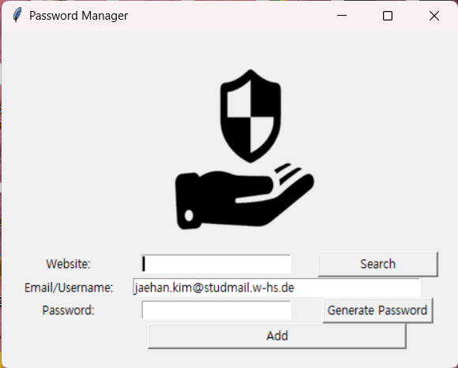

# Password Manager

Introducing a sweet little app that helps you generate and store passwords to manage login credentials for various websites.

## Features

- **Password Generation**: Easily generate strong passwords.
- **Storage**: Save and manage website URLs, email/usernames, and passwords.
- **Search**: Quickly access stored information by searching.

## Usage

1. Enter the website URL in the website field.
2. Enter the login information for the respective site in the email/username field.
3. Enter a new password or input an existing one in the password field.
4. Click the "Generate Password" button to automatically generate a strong password.
5. Click the "Add" button to save the information.
6. To search for stored information, click the "Search" button.

## Note

- This app stores data in a `data.json` file, which should be located in the same folder as the running script.
- Additionally, ensure that the `logo.png` file is always in the same folder as the executable file (`main.exe`).

## Screenshots

## Note

- This app stores data in a `data.json` file, which should be located in the same folder as the running script.

## Contributing

Contributions are welcome! Feel free to open issues for bug reports or feature requests.
